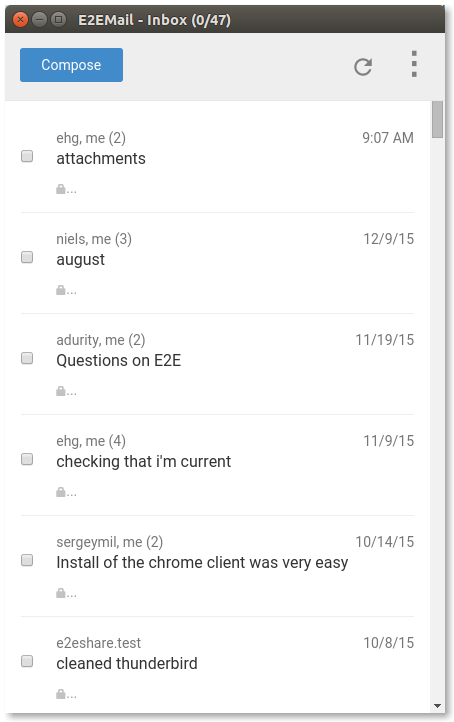

#  E2EMail

This is an experimental version of a simple Chrome application - a Gmail client that exchanges OpenPGP mail. At this stage, we recommend you use it only for testing and UI feedback.

E2EMail is a simple way for non-technical users to exchange private text mail over Gmail, but is not a fully-featured email or OpenPGP client.

It is a Chrome app that runs independent of the normal Gmail web interface. It behaves as a sandbox where you can only read or write encrypted email, but is otherwise similar to any other communication app.

When launched, the app shows just the encrypted mail in the user's Gmail account. Any email sent from the app is also automatically signed and encrypted.



# Why

E2EMail is being developed to provide an easy and intuitive way for non-technical users to exchange confidential email.

The goal is to improve data confidentiality for occasional small, sensitive messages. This way even the mail provider, Google in the case of Gmail, is unable to extract the message content. However, it does not protect against attacks on the local device, and, as usual with PGP, the identities of the correspondents and the subject line of the mail is not protected.

The initial version only supports ordinary text email, and focuses on new users who all use E2EMail to read PGP/MIME mail.

# How

E2EMail is built on the Google end-to-end library, please refer to [its threat model](https://github.com/google/end-to-end/wiki/Threat-model) for a detailed analysis of the basic security properties.

The target is a simple user experience - install app, approve permissions, start reading or send sending messages. As a result, the app automatically handles most of the key management.

## Key management

In this initial version, E2EMail hosts its own keyserver. During app installation, it automatically generates an OpenPGP ECC key and uploads the public half to the keyserver. The keyserver accepts it if the user-id in the key matches an OAuth mediated check against the user's email address.

The private half is stored locally, but can be regenerated via a secret "recovery code" provided to the user during installation. This code is a 128-bit value that can recreate the key material, and can also be used to regenerate the private key on a different device.

When sending email, the app automatically looks up the recipient's public key in the keyserver. If it doesn't find it, the user cannot create the email, but may choose to send a pre-canned, unencrypted invitation for the recipient to install the app instead.

If the recipient's key is found, it is saved locally and checked for subsequent changes (trust on first use/warn on change.) Sophisticated users may still compare key fingerprints in the traditional OpenPGP manner.

To address the risk of the keyserver introducing spurious keys and to facilitate interoperability, we are [evaluating solutions](http://wiki.gnupg.org/OpenPGPEmailSummit201512?action=AttachFile&do=view&target=key_transparency.pdf) that add transparency and federation to the keyserver. We will adapt the client to use these services as the designs mature and have concrete implementations.

For now, we use a simple app-engine implementation that runs the OAuth check (but does not offer transparency) so we can independently evolve the client, but is not meant for long-term use.

## Email

The app uses the GMail API to read and send PGP/MIME messages. It also uses the GMail contacts API to enable auto-completing addresses. It reads and sends standard PGP/MIME messages, and emails are organized by threads into a simple list. A simple form is used to to start or reply to threads, and just text content is supported at the moment.

As with standard PGP/MIME messages, we do not encrypt subject lines or other headers, but plan to track [ongoing efforts](http://wiki.gnupg.org/HeaderProtectionWithMemoryHole) to standardize encrypted headers.

## Building

To build the app, you will need git, python, jdk1.7 or above, and ant.

First clone this repository
```
$ git clone https://github.com/e2email-org/e2email
```
Go into the `e2email` directory and do a one-time setup to pull in its dependencies
```
$ ./do.sh setup
```
Finally, build the app
```
$ ./do.sh build
```
If everything goes well, an unbundled version of the app can be found under `build/e2email`. You can load this directory in developer mode within Chrome and start up the app. Visit `chrome://extensions` and enable developer mode, click "Load unpacked extension..." and open the `build/e2email` directory.

To run tests under karma, you should further install nodejs, npm and nvm.
```
$ ./do.sh karma
```
This starts up a web server, providing a URL where you can point your Chrome browser and run the tests.

# Attributions

This repository uses code and assets from:

* [Angular.js](https://github.com/angular/angular.js) Copyright (c) 2010-2016 Google, Inc and used under [the MIT licence](https://github.com/angular/angular.js/blob/master/LICENSE).
* [Google End-To-End](https://github.com/google/end-to-end) Copyright 2014-2016 Google, Inc and used under the [Apache v2 License](https://github.com/google/end-to-end/blob/master/LICENSE).
* [Google Roboto fonts](https://github.com/google/roboto) Copyright 2015 Google, Inc and used under the [Apache v2 License](https://github.com/google/roboto/blob/master/LICENSE)
* [Twitter Bootstrap](https://github.com/twbs/bootstrap) Copyright 2011-2016 Twitter, Inc and used under [the MIT license](https://github.com/twbs/bootstrap/blob/master/LICENSE).
